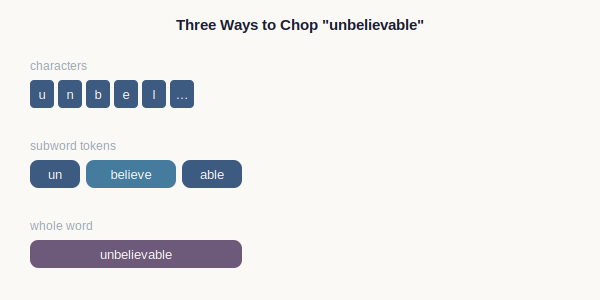
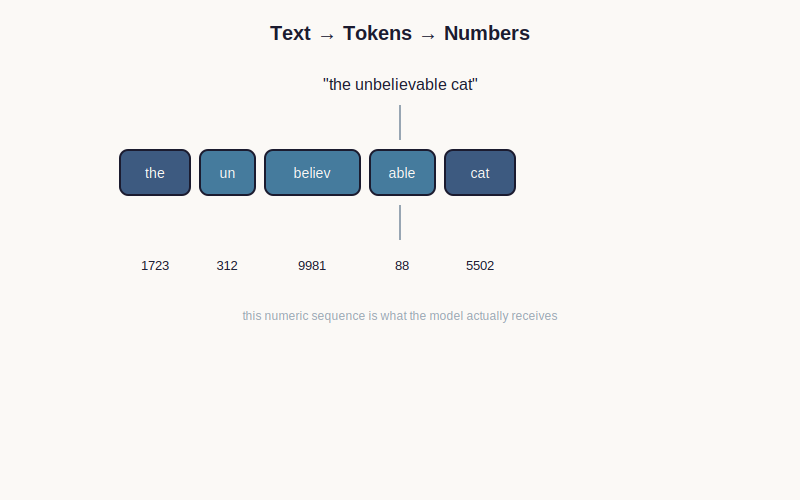

# Chapter 3 — Characters, Words and Tokens

> **Part:** Information · **Concept Level:** Level 1 · **Prerequisites:** Chapter 2 (symbols, computation)
> **New concepts introduced:** Characters, Words, Tokens, Tokenization

---

## 1. Opening Question

> *How does a computer break language into pieces it can actually work with?*

## 2. Real-World Story

Try to teach a child to read, and you don't start with whole words. You
start with letters, then blend them into syllables, then into words. But a
fluent adult reader doesn't process "unbelievable" as u-n-b-e-l-i-e-v-a-b-l-e.
They also don't necessarily process it as one indivisible chunk — most
people can spot "un-," "believe," and "-able" inside it without effort, and
that decomposition helps them guess the meaning of an unfamiliar word like
"unfollowable" the first time they ever see it.

This turns out to be close to the exact problem a computer faces with
language, and close to the exact solution it uses. Chop language into pieces
too small (individual letters) and you lose efficiency — everything takes
forever to process, and the pieces carry very little meaning individually.
Chop it into pieces too large (whole words only) and you're stuck: languages
invent new words constantly, people misspell things, and a system that only
knows a fixed list of whole words breaks the instant it meets one that isn't
on the list.

## 3. Visual Explanation

  

*Takeaway: the same word can be split at three different grain sizes — subword tokens are the middle ground modern models actually use.*

## 4. Core Intuition

A **character** is the smallest unit of written text — a single letter,
digit, or punctuation mark. A **word** is a familiar, larger unit — but
"word" turns out to be a slippery concept computationally, since new words
appear constantly and different languages don't even agree on where one
word ends and another begins.

A **token** is the actual unit a language model works with — a chunk of
text that might be a whole word, a piece of a word, a single character, or
even a punctuation mark, chosen by a process called **tokenization** that
looks at enormous amounts of text in advance and decides which chunks are
common enough to deserve their own reusable piece.

The key design insight: build a fixed-size set of a few tens of thousands of
these chunks, chosen so that common words get their own single token
("the," "is," "cat") while rare or unfamiliar words get broken into
familiar sub-pieces ("un" + "believ" + "able"). This way, the model never
encounters a word it has literally no way to represent — it can always fall
back to smaller, familiar pieces.

## 5. Technical Explanation

The dominant approach, used by essentially every major language model
today, is a family of algorithms broadly called subword tokenization (the
best-known variant is called Byte-Pair Encoding, or BPE). The process
works, conceptually, like this: start with individual characters as the
smallest possible units. Scan a huge amount of text and find the pair of
units that appears together most frequently. Merge that pair into a single
new unit. Repeat this merging process tens of thousands of times. The
result is a fixed vocabulary where extremely common sequences ("ing," "the,"
common whole words) have been merged all the way up into single tokens,
while rare sequences remain split into smaller pieces.

Every token in this final vocabulary is assigned a numerical ID — since,
per Chapter 2, computation ultimately requires everything to be represented
as symbols the machine can manipulate mechanically. A sentence is
tokenized by matching it against this fixed vocabulary and converting it
into a sequence of these numerical IDs, which is the actual input a model
receives — the model never sees letters or words as such, only this
sequence of numbers.

## 6. Common Misconceptions

> **Misconception:** "The model reads text one letter at a time, like sounding out a word."
> **Why it's wrong:** Character-by-character processing is far too slow and loses too much structure for large-scale models; subword tokenization deliberately groups common sequences into single units to avoid this.
> **Correct intuition:** The model reads a sequence of tokens, most of which are whole words or common word-fragments, not individual letters.
> **Analogy:** A fluent reader doesn't sound out "the" letter by letter — they recognize it instantly as a single familiar shape.

> **Misconception:** "A token is always exactly one word."
> **Why it's wrong:** Tokenizers deliberately split rare, long, or unfamiliar words into multiple sub-word tokens, and can also merge very common short words with surrounding punctuation.
> **Correct intuition:** A token is whatever chunk of text the vocabulary happened to assign a single ID to — sometimes a whole word, sometimes a fragment, sometimes less than a word.
> **Analogy:** Postal abbreviations aren't one-per-word either — common words get short codes ("St.," "Ave.") while unusual street names are spelled out in full.

## 7. Practical Implications

This is why AI providers bill by "tokens," not by words or characters — and
why the same sentence can cost a different amount depending on the
language it's written in (some languages tokenize less efficiently than
English in many popular tokenizers). It also explains a famous class of
AI failures: ask a model to count the letters in a word, or reverse a word
letter-by-letter, and it can stumble — because it isn't actually seeing
individual letters, it's seeing tokens, and a token doesn't expose its own
internal letters to the model in an obvious way.

## 8. Canonical Mental-Model Diagram

  

**Takeaway: a language model never sees letters or words — it sees a sequence of token IDs produced by tokenization, some whole words and some fragments.**

## 9. One-Page Summary

- Characters are the smallest text units; words are a familiar but computationally slippery unit; tokens are the actual chunks a model uses.
- Tokenization builds a fixed vocabulary (tens of thousands of tokens) where common sequences become single tokens and rare ones stay split into pieces.
- Byte-Pair Encoding (BPE) is the dominant algorithm: repeatedly merge the most frequent adjacent pair of units to build up the vocabulary.
- Every token is assigned a numeric ID; a model's actual input is a sequence of these IDs, never raw letters or words.
- This design guarantees any input text can be represented, even words the model has never seen whole.
- Token-based billing and letter-counting failures both trace back directly to this chapter's ideas.

## 10. Further Reading

- Search for an interactive "tokenizer visualizer" or "tokenizer playground" from any major AI lab — several publish free web tools that show exactly how a sentence you type gets split into tokens and their numeric IDs, which makes this chapter's core idea concrete in under a minute.

## 11. The Next Obvious Question

> *If text becomes a long sequence of small tokens, how does a model deal with the fact that meaning is spread out and repeated across that sequence — and can that sequence be represented more efficiently?*

---

**Glossary terms added this chapter:** Character, Word, Token, Tokenization, Byte-Pair Encoding (BPE) → append to `/glossary.md`
**Misconceptions logged this chapter:** "model reads letter by letter"; "a token is always one word" → append to `/misconceptions.md`
**Concept-graph entries checked off:** Level 1 — Characters, Words, Tokens, Tokenization, all at Ch. 3
