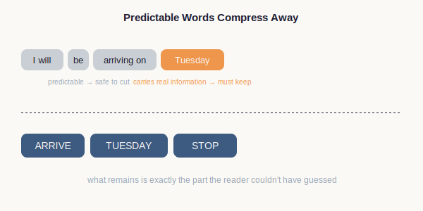
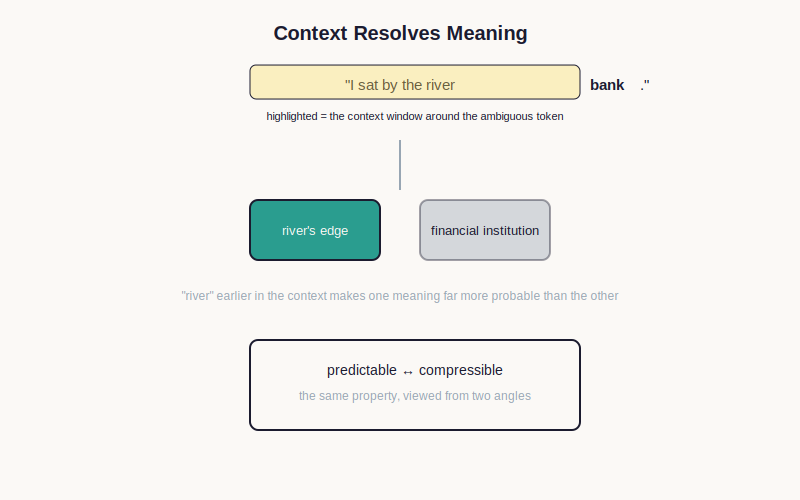

# Chapter 4 — Compressing Language

> **Part:** Information · **Concept Level:** Level 1 · **Prerequisites:** Chapter 2 (information, probability), Chapter 3 (tokens)
> **New concepts introduced:** Compression, Context

---

## 1. Opening Question

> *Why can a short sentence carry so much meaning, and how do computers exploit that?*

## 2. Real-World Story

In the era of the telegram, you paid by the word. This produced a strange,
clipped dialect: "ARRIVE TUESDAY STOP NEED CAR STOP" instead of "I will be
arriving on Tuesday and I'll need you to arrange a car for me." Nobody
taught telegram writers information theory, but they were all doing the
same thing intuitively: cutting every word whose absence the reader could
easily reconstruct from what remained. "I will be" is obvious from context;
cutting it costs you nothing. "Tuesday" is the one piece of the message you
truly cannot guess in advance; that word has to stay.

This is exactly the same instinct behind modern text abbreviations like
"lol" or "brb" — they work only because both sides already share enough
context to fill in the missing pieces. Compression isn't about making a
message shorter for its own sake. It's about identifying which parts of a
message are predictable — and therefore cheap to omit or shrink — and which
parts genuinely carry new information and must be preserved in full.

## 3. Visual Explanation

  

*Takeaway: compressing a message means removing what the reader can predict, not removing meaning.*

## 4. Core Intuition

**Compression** is the process of representing information using fewer
symbols by exploiting redundancy — the parts of a message that are
predictable given what's already been said or what's commonly known. This
directly follows from Chapter 2's idea of information as "surprise":
predictable content carries little information, so it can be represented
very cheaply (or dropped) without losing much; unpredictable content
carries a lot of information and must be preserved.

**Context** is the surrounding material that makes a piece of language
predictable — or that resolves which of several possible meanings a word
has. The word "bank" means something completely different in "I sat by the
river bank" versus "I deposited a check at the bank." Nothing about the
word "bank" itself tells you which meaning is intended — only the tokens
around it do. Context is what turns an ambiguous token into a specific
meaning.

These two ideas are deeply connected: a system that is good at predicting
what comes next, given context, is automatically good at compression —
because "predictable" and "compressible" are the same property viewed from
two different angles.

## 5. Technical Explanation

Formally, compression schemes exploit statistical redundancy in a
sequence: symbols or sequences that occur frequently (and are therefore
predictable) are assigned short representations, while rare, unpredictable
ones are assigned longer representations — this is precisely the same
principle behind Morse code's letter lengths in Chapter 2, and behind the
subword-merging tokenizer in Chapter 3. In fact, tokenization is itself a
form of compression: common multi-character sequences get compressed into
a single token, exploiting exactly this redundancy.

Context, formally, is the span of surrounding tokens a system considers
when interpreting or predicting a given token. A model doesn't process
"bank" in isolation — it processes the entire surrounding sequence, and
uses that sequence to narrow down which of "bank"'s possible meanings (or
which of many possible next tokens) is most probable in this particular
instance. The richer and more relevant the available context, the sharper
this narrowing becomes — a theme that will resurface, in a much more
consequential form, when we cover context windows and memory in Part IV.

## 6. Common Misconceptions

> **Misconception:** "Compressing language means losing quality or meaning, like a blurry, low-resolution photo."
> **Why it's wrong:** Good compression specifically targets redundant, predictable content — the exact opposite of the parts of a message that carry meaning.
> **Correct intuition:** Compression removes what could be reconstructed anyway; what's left is precisely the informative core of the message.
> **Analogy:** Removing the words "I will be" from "I will be arriving Tuesday" loses nothing a reader couldn't reconstruct — unlike smudging out a photo's details, which are never recoverable.

> **Misconception:** "Context just means 'the general topic' being discussed."
> **Why it's wrong:** Context, in this technical sense, is the specific sequence of surrounding tokens — not a vague subject label — and it can resolve very fine-grained ambiguity, not just topic.
> **Correct intuition:** Context is the exact material immediately around a token that a model actually conditions its interpretation on.
> **Analogy:** Knowing the "topic" of a conversation is a river — but knowing the *exact previous sentence* is what tells you whether "bank" means the water's edge or the building down the street.

## 7. Practical Implications

Once you understand compression-as-redundancy-removal, engineering
discussions about "efficient tokenizers" and "context compression"
techniques stop sounding like marketing buzzwords and start sounding like
the same simple idea applied at different scales. And once you understand
that context is what disambiguates meaning, you'll immediately see why
giving an AI system too little surrounding context produces vague or wrong
answers — it isn't being lazy, it genuinely lacks the disambiguating
material a human would have used.

## 8. Canonical Mental-Model Diagram

  

**Takeaway: context is the highlighted span of surrounding tokens a model uses to resolve ambiguity — and the same predictability that resolves meaning is what makes language compressible.**

## 9. One-Page Summary

- Compression exploits redundancy: predictable content is cheap to represent; unpredictable content must be preserved in full.
- This is the same principle behind Morse code letter-lengths and behind subword tokenization — both compress by favoring common patterns.
- Context is the specific surrounding sequence of tokens that disambiguates meaning, not a vague notion of "topic."
- A word like "bank" has no fixed meaning on its own — context selects among its possible meanings.
- Predictability and compressibility are the same property: a system good at predicting what's next is automatically good at compressing.
- Insufficient context produces vague or wrong outputs because the disambiguating material simply isn't available — not because of laziness.

## 10. Further Reading

- Look into classic text-compression algorithms (e.g. Huffman coding) for a concrete, historical example of assigning shorter codes to more frequent symbols.

## 11. The Next Obvious Question

> *If meaning depends so heavily on context and surrounding tokens, how can a computer represent "meaning" itself in a form it can actually compute with?*

---

**Glossary terms added this chapter:** Compression, Context (as surrounding disambiguating sequence) → append to `/glossary.md`
**Misconceptions logged this chapter:** "compression loses meaning like a blurry photo"; "context just means the general topic" → append to `/misconceptions.md`
**Concept-graph entries checked off:** Level 1 — Compression, Context, both at Ch. 4
