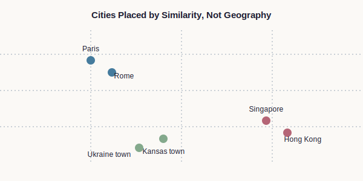
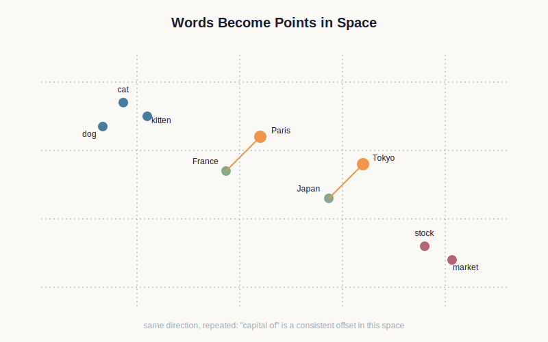

# Chapter 5 — Meaning as Geometry

> **Part:** Information · **Concept Level:** Level 2 · **Prerequisites:** Chapter 3 (tokens), Chapter 4 (context)
> **New concepts introduced:** Embeddings, Vector spaces, Similarity, Semantic geometry

---

## 1. Opening Question

> *How can a computer represent the meaning of a word, not just the word itself?*

## 2. Real-World Story

Imagine redrawing a map of the world's cities — not by geography, but by
culture and economy. Paris and Rome end up near each other, not because
they're close in physical distance (they aren't, especially), but because
they're similar in the things that matter for this map: history, climate,
food culture, tourism patterns. Singapore ends up near Hong Kong for
similar reasons. A farming town in Kansas ends up near a farming town in
Ukraine, despite being on opposite sides of the planet, because on *this*
map, distance means "how alike," not "how many miles."

Once you've built a map like this, distance becomes meaningful in a new
way: how close two cities are on the page tells you how similar they are.
And more than that — the *direction* from one city to another can mean
something too. The direction from "Paris" to "France's capital" might be
roughly the same direction as from "Tokyo" to "Japan's capital," because
that direction consistently represents the same relationship: capital-of.

This is exactly the trick computers use to represent the meaning of words.

## 3. Visual Explanation

  

*Takeaway: closeness on this map means "similar," and the map's axes have nothing to do with physical geography.*

## 4. Core Intuition

An **embedding** is a location — a point — assigned to a word (or a token)
in a space with many dimensions, chosen so that words with similar meanings
end up at nearby points. "Cat" and "kitten" end up close together. "Cat"
and "stock market" end up far apart.

This space is called a **vector space**: instead of two dimensions like a
paper map, it typically has hundreds of dimensions — far more than we can
visualize directly, but the same basic idea applies: a location is
described by a list of numbers (its coordinates), just a much longer list
than "latitude, longitude."

**Similarity** between two words is measured by how close their points are
in this space. Closeness is not decided by hand — it emerges automatically
from how the words are actually used across enormous amounts of text: words
that tend to appear in similar surrounding contexts (see Chapter 4) end up
placed near each other.

**Semantic geometry** is the idea that meaningful relationships between
words correspond to consistent geometric patterns — directions and
distances — in this space. The relationship "capital of" tends to point in
roughly the same direction wherever it appears: from "France" to "Paris"
and from "Japan" to "Tokyo" alike.

## 5. Technical Explanation

An embedding is, precisely, a list of numbers — a vector — associated with
each token in the vocabulary built in Chapter 3. These numbers aren't
assigned by hand; they are learned automatically by having a system observe
which tokens tend to appear in similar contexts across a huge body of text,
and gradually adjusting each token's numbers so that tokens with similar
contextual patterns end up with similar (nearby) vectors. This learning
process is the subject of Chapter 9; for now, take the result as given.

Similarity between two embeddings is typically computed as a geometric
measure of how close their vectors are — conceptually the same as measuring
distance between two points on a map, just generalized to hundreds of
dimensions instead of two. Two tokens used in near-identical contexts end
up with near-identical vectors and therefore high similarity.

Crucially, this space captures more than just "these two things are
similar." Consistent relationships between pairs of words can correspond to
consistent directions in the space — the geometric offset from a country's
embedding to its capital's embedding lands close to the same offset for
several other country/capital pairs. This is what "semantic geometry"
means: meaning-relationships can become measurable geometric structure, not
just proximity. Treat the country/capital example as one clean, memorable
illustration of the general principle, not a universal law — real embedding
spaces are messier than this, the pattern holds more cleanly for some
relationships than others, and it varies from model to model.

One more caveat matters here, and it will matter a great deal in Part III.
The embedding described in this chapter is a token's *starting* location —
a general-purpose position learned from that token's typical usage across
every context it ever appeared in during training. It is not yet the whole
story. Once a model actually reads a specific sentence, it repeatedly
revises this starting location based on the exact words surrounding it, so
that "bank" in "river bank" ends up, temporarily, in a different place than
"bank" in "investment bank" — even though both start from the same point on
this chapter's map. That revision process is called attention, and it's the
subject of Chapter 11. Everything in this chapter describes a token's
initial position, not its final, in-context one.

## 6. Common Misconceptions

> **Misconception:** The model stores dictionary definitions.
> **Why it's wrong:** Nowhere in an embedding is there a stored sentence explaining what a word means — there is only a location in space, learned from patterns of use.
> **Correct intuition:** The model learns locations in a geometric space.
> **Analogy:** Cities on a map.

> **Misconception:** "Similarity in this space just means 'these words are synonyms.'"
> **Why it's wrong:** Words end up close together whenever they're used in similar contexts, which captures far more than synonymy — antonyms like "hot" and "cold," for instance, often end up relatively close too, since they're used in nearly identical grammatical contexts ("the water is ___").
> **Correct intuition:** Closeness reflects similarity of *use and context*, which is a broader and sometimes subtler relationship than "means the same thing."
> **Analogy:** On the culture-and-economy city map, two rival neighboring capitals might sit close together despite being political opposites — closeness there tracked "type of place," not "gets along with."

> **Try it yourself, before reading on:** would you expect "hot" to sit closer to "cold," or closer to "sandwich," on this map? Most people's first instinct is "sandwich" — hot and cold feel like opposites, so surely they shouldn't be neighbors. But "hot" is actually closer to "cold": both fill the same slot in the same kinds of sentences ("the water is ___," "turn the ___ tap"), while "sandwich" almost never does. If your first guess was "sandwich," you were reasoning about *meaning-as-agreement* rather than *meaning-as-use* — exactly the misconception above, caught in the act.

> **Misconception:** "An embedding is a word's one true, permanent representation of meaning, the same wherever it appears."
> **Why it's wrong:** What this chapter describes is a token's starting location, learned from its typical usage across all contexts. A model revises that location based on the specific sentence it's actually reading — a process called attention (Chapter 11) — producing a different, in-context representation each time.
> **Correct intuition:** This chapter's embedding is a token's general-purpose starting point, not its final, in-context meaning — the final meaning is computed fresh for every sentence.
> **Analogy:** A person's home address is a fixed, general-purpose location — but where they actually are right now, in context, changes throughout the day. This chapter describes the home address; Chapter 11 describes where the token actually is right now.

## 7. Practical Implications

This is the mechanism behind "semantic search," where a search engine finds
results that match your *meaning* rather than your exact words — because
your query and a relevant document end up with nearby embeddings even if
they share no words in common. It's also the foundation underneath vector
databases and retrieval-augmented generation, both covered in Part IV — in
both cases, "find relevant information" is implemented, underneath, as
"find nearby points in this space."

## 8. Canonical Mental-Model Diagram

  

**Takeaway: embeddings place words as points in a high-dimensional space, where nearby points mean similar usage and consistent directions capture consistent relationships.**

## 9. One-Page Summary

- An embedding is a location (a vector — a list of numbers) assigned to each token in a high-dimensional space.
- Words with similar meanings and contexts end up at nearby points, learned automatically from patterns of use, not assigned by hand.
- A vector space generalizes the idea of a map's coordinates to hundreds of dimensions instead of two.
- Similarity between words is measured by geometric closeness between their embeddings.
- Semantic geometry means relationships (like "capital of") correspond to consistent directions in this space, not just proximity.
- Common misconception: the model does not store definitions — it stores locations, learned from context of use.
- This geometric representation of meaning underlies semantic search, vector databases, and retrieval-augmented generation, covered later in the book.

## 10. Further Reading

- Search for visualizations of "word2vec" or embedding-space projections (e.g. via t-SNE or UMAP) to see real high-dimensional embeddings projected down to two dimensions for viewing.

## 11. The Next Obvious Question

> *Now that a computer can represent the meaning of a word as a location in space, how can it learn to predict what word is likely to come next in a sentence?*

---

**Glossary terms added this chapter:** Embedding, Vector space, Similarity, Semantic geometry → append to `/glossary.md`
**Misconceptions logged this chapter:** "the model stores dictionary definitions"; "similarity just means synonym"; "an embedding is a word's one true, permanent meaning" → append to `/misconceptions.md`
**Concept-graph entries checked off:** Level 2 — Embeddings, Vector spaces, Similarity, Semantic geometry, all at Ch. 5
