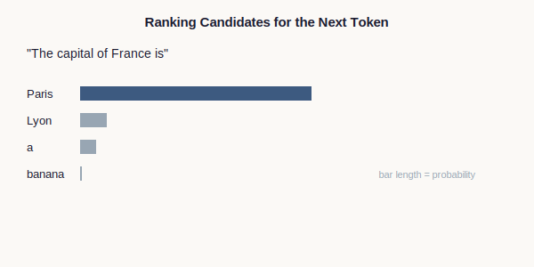
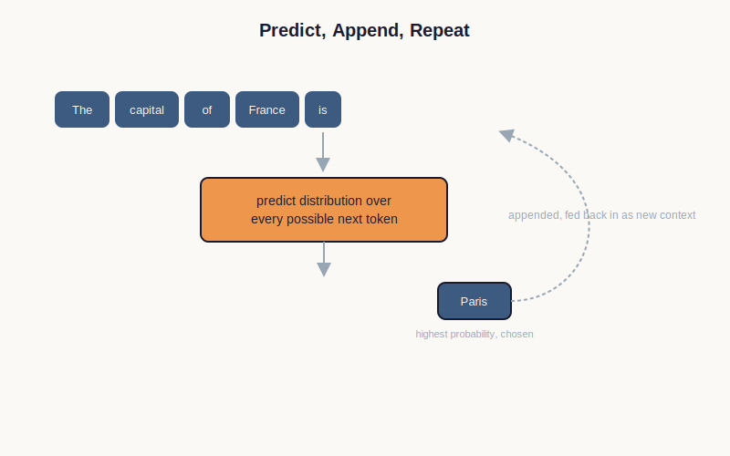

# Chapter 6 — Predicting the Next Token

> **Part:** Prediction · **Concept Level:** Level 3 · **Prerequisites:** Chapter 2 (probability), Chapter 5 (embeddings)
> **New concepts introduced:** Prediction

---

## 1. Opening Question

> *Now that a computer can represent meaning as a location in space, how can it use that to predict what comes next?*

## 2. Real-World Story

Type the start of a text message on almost any phone, and a small row of
suggested words appears above the keyboard: "I'll be there in about..." and
the keyboard offers "5," "10," "an hour." It isn't reading your mind. It's
doing something much narrower: given everything you've typed so far, it's
ranking every word it knows by how likely that word is to come next, and
showing you the top few.

A modern language model does exactly this — just far more capably, and not
just for the next word, but for the word after that, and the word after
that, one at a time, each new prediction taking into account everything
generated so far, including its own previous guesses. A full paragraph
isn't planned in advance and then written down. It's built one token at a
time, the same small act — "what's the most likely next piece?" — repeated
until a stopping point is reached.

## 3. Visual Explanation

  

*Takeaway: at each step, every possible next token gets a probability — most are near zero, and a handful are plausible.*

## 4. Core Intuition

**Prediction**, in this technical sense, means assigning a probability to
every token in the vocabulary (built back in Chapter 3), representing how
likely that token is to come next given everything before it. The model
doesn't pick one "correct" next word out of certainty — it produces an
entire ranked distribution, most of it close to zero probability, with a
handful of genuinely plausible candidates near the top.

Generating text is then just this single step, repeated: predict a
distribution over the next token, choose one (the highest-probability
option, or something close to it — the precise choice mechanism is covered
in Chapter 14), append it to the sequence, and predict again — now with
one more token of context than before. A whole essay is built this way,
one narrow decision at a time, each decision informed by everything decided
before it.

## 5. Technical Explanation

Formally, a language model computes a probability distribution over its
entire token vocabulary, conditioned on the sequence of tokens seen so far.
This calculation draws on the embeddings from Chapter 5 — tokens with
similar meanings and similar typical contexts produce similar predictions,
which is precisely why the geometry of Chapter 5 matters here: predicting
well requires generalizing from the geometric neighborhood of a token, not
just recalling that exact token's history.

This process, where each new token is generated using all previously
generated tokens as its context, is called autoregressive generation. It
means the model never "sees" the future of its own output while generating
the present token — everything downstream is genuinely undetermined until
it's produced, one narrow step at a time. This has real consequences: it's
part of why a model can occasionally back itself into an inconsistent
corner mid-response, since no single step has a view of the entire planned
answer — a limitation Chapter 24 revisits when discussing how reasoning
models try to work around it.

## 6. Common Misconceptions

> **Misconception:** "The model plans out the entire sentence in advance, then writes it down."
> **Why it's wrong:** Generation is autoregressive — each token is predicted one at a time, using only what's been generated so far, with no access to a pre-formed plan of the whole response.
> **Correct intuition:** Coherence emerges from consistently good next-token predictions, not from an upfront outline the model is secretly following.
> **Analogy:** A jazz musician improvising a solo doesn't have the whole solo pre-written — each note is chosen in light of everything played so far, and the result can still sound coherent.

> **Misconception:** "Predicting the next token means looking up the answer in a giant table of memorized sentences."
> **Why it's wrong:** The model computes a fresh probability distribution from the current context every time; it isn't matching against a stored table of full sentences (Chapter 7 explains in detail why a table-based approach doesn't work at this scale).
> **Correct intuition:** Prediction is a computation performed over the geometry of Chapter 5, not a lookup.
> **Analogy:** A weather forecaster doesn't look up "what happened on a day exactly like this one" in a logbook — they compute a forecast from current conditions using a general-purpose model of the atmosphere.

## 7. Practical Implications

Recognizing that generation happens one token at a time, using only what's
already been produced, explains a lot of real, observable model behavior:
why models can contradict something they said two sentences earlier, why
asking a model to "think step by step" tends to improve accuracy on harder
problems (it gives the model intermediate tokens to condition on before
committing to a final answer), and why the very first token of a response
can matter disproportionately to how the rest of the response unfolds.

## 8. Canonical Mental-Model Diagram

  

**Takeaway: text is generated one token at a time — predict a distribution, choose a token, append it, and predict again with the longer sequence as new context.**

## 9. One-Page Summary

- Prediction means assigning a probability to every token in the vocabulary, given everything before it.
- Text generation is autoregressive: predict, choose, append, repeat — one token at a time.
- Predictions draw on the geometry of embeddings (Chapter 5), letting the model generalize rather than merely recall.
- No step has access to a pre-formed plan of the entire response — coherence is emergent, not scripted in advance.
- This explains why models can contradict themselves mid-response, and why "thinking step by step" tends to help on harder problems.

## 10. Further Reading

- Search for "autoregressive language model" for the formal name of the generation process described here.

## 11. The Next Obvious Question

> *Why not just count how often one word follows another in a giant table, instead of building something as complicated as this — isn't that simpler?*

---

**Glossary terms added this chapter:** Prediction, Autoregressive generation → append to `/glossary.md`
**Misconceptions logged this chapter:** "the model plans the whole sentence in advance"; "prediction is a lookup in a memorized table" → append to `/misconceptions.md`
**Concept-graph entries checked off:** Level 3 — Prediction, at Ch. 6
